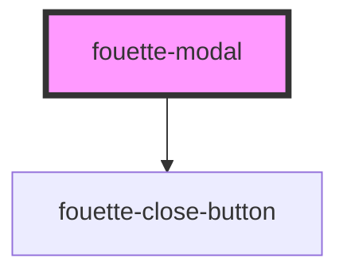

# fouette-modal

<!-- Auto Generated Below -->

## Properties

| Property    | Attribute    | Description | Type      | Default     |
| ----------- | ------------ | ----------- | --------- | ----------- |
| `modalType` | `modal-type` |             | `string`  | `undefined` |
| `opened`    | `opened`     |             | `boolean` | `undefined` |

## Dependencies

### Depends on

- [fouette-close-button](../close-button)

### Graph

----------------------------------------------

*Built with [StencilJS](https://stenciljs.com/)*
