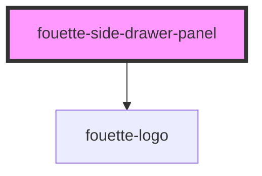

# fouette-side-drawer-panel

<!-- Auto Generated Below -->

## Properties

| Property     | Attribute     | Description | Type     | Default     |
| ------------ | ------------- | ----------- | -------- | ----------- |
| `panelTitle` | `panel-title` |             | `string` | `undefined` |

## Events

| Event        | Description | Type               |
| ------------ | ----------- | ------------------ |
| `openDrawer` |             | `CustomEvent<any>` |

## Dependencies

### Depends on

- [fouette-logo](../logo)

### Graph

----------------------------------------------

*Built with [StencilJS](https://stenciljs.com/)*
