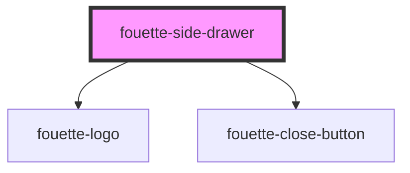

# fouette-side-drawer

<!-- Auto Generated Below -->

## Properties

| Property | Attribute | Description | Type      | Default     |
| -------- | --------- | ----------- | --------- | ----------- |
| `email`  | `email`   |             | `string`  | `undefined` |
| `extra`  | `extra`   |             | `string`  | `undefined` |
| `footer` | `footer`  |             | `string`  | `undefined` |
| `header` | `header`  |             | `string`  | `undefined` |
| `link`   | `link`    |             | `string`  | `undefined` |
| `opened` | `opened`  |             | `boolean` | `undefined` |
| `phone`  | `phone`   |             | `string`  | `undefined` |

## Dependencies

### Depends on

- [fouette-logo](../logo)
- [fouette-close-button](../close-button)

### Graph

----------------------------------------------

*Built with [StencilJS](https://stenciljs.com/)*
